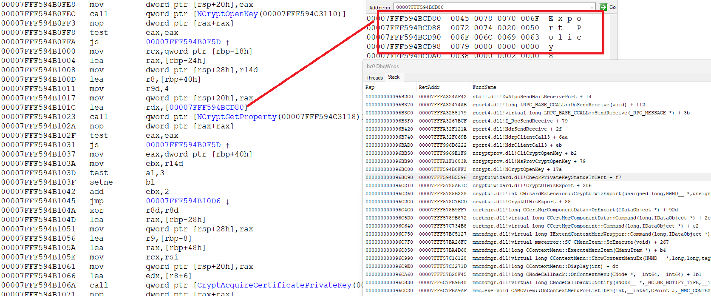
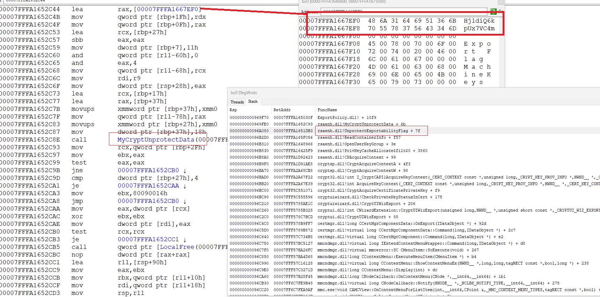

********************************************************************************

How to export certificate private key ( assume it not on smartcard but stored in file) even if it marked as not exportable ?

really this is possible and not too complex. are key is exportable or not saved in file/container, where private key is located too.
all what we need - hook data after decrypt and set exportable flag

here 2 case exist - cert can use legacy CSP or CNG storage providers. (look for `CRYPT_KEY_PROV_INFO` Structure )

in case CSP we need hook `CryptUnprotectData` api in current process ( usually this is mmc.exe if user use UI )

and look for magic value in pOptionalEntropy - `"Hj1diQ6kpUx7VC4m"`

look for [UnprotectExportabilityFlag](https://github.com/wisny101/Windows-Server-2003-Source/blob/master/ds/win32/ntcrypto/contman/contman.c#L1087)

and

[#define STUFF_TO_GO_INTO_MIX "Hj1diQ6kpUx7VC4m"](https://github.com/wisny101/Windows-Server-2003-Source/blob/master/ds/win32/ntcrypto/inc/contman.h#L58)

in case CNG is used we need inject dll to lsass. of course if it is PPL process, this is separate topic. but if not - no any problem do this

here we need hook `CryptUnprotectDataNoUI` from dpapi.dll and look for another magic

char DPAPI_ENTROPY_CNG_KEY_PROPERTIES[] = ["6jnkd5J3ZdQDtrsu";](https://o365blog.com/post/deviceidentity/)

by fact we change result of call to `NCryptGetProperty` with `NCRYPT_EXPORT_POLICY_PROPERTY` (`L"Export Policy"`) 
and set `NCRYPT_ALLOW_EXPORT_FLAG|NCRYPT_ALLOW_PLAINTEXT_EXPORT_FLAG` (3)

and this is all.

so screenshots from debugger  

CNG



CSP



code of DLL which do hooks/unhooks in [src](src) project. look for [Entropy.cpp](src/Entropy.cpp)

for load/unload dll i use very simply project [Inject](Inject) this is console application, which inject dll 
to already runnig lsass/mmc and wait on key press. after this unload dll and exit


********************************************************************************

say we want use some api, but it not in any lib file. because lib for this DLL not exist at all, or exist, but this api not included for it

of course we can resolve api address at runtime, by LoadLibrary/GetProcAddress. but what if we want "static" link ?
say we need use many functions ( as example certca.dll / certcli.dll export very many useful api and no exist lib files for both)
we can build lib file, with this api by self. really this is not hard. we need only correct definitions of this api in DEF/OBJ file for build. the implementation can be empty

how is linker use DEF/OBJ for produce LIB/EXP (in DLL) ?

assume `[p]AAA[s]` is C/C++ decorated name , where [p] prefix and [s] suffix. and `AAA` undecorated form.

as example

in `_ChrCmpIAStub@8` `[p]` is `_`, `AAA` is `ChrCmpIAStub` and `[s]` is `@8`

or in case `?HRGN_UserUnmarshal64@@YAPEAEPEAKPEAEPEAPEAUHRGN__@@@Z` this is `?` + `HRGN_UserUnmarshal64` + `@@YAPEAEPEAKPEAEPEAPEAUHRGN__@@@Z`

logic of linker is next

```

  DEF          │  OBJ        │  LIB               │  EXP
───────────────┼─────────────┼────────────────────┼───────
AAA            │     AAA     >  __imp_AAA         │  AAA
AAA = BBB      │     BBB     >  __imp_AAA         │  AAA
AAA = mod.BBB  │     BBB     >  __imp_AAA         │  AAA ─> mod.BBB
AAA            │  [p]AAA[s]  >  __imp_[p]AAA[s]   │  AAA
AAA = BBB      │  [p]BBB[s]  >  __imp_[p]AAA[s]   │  AAA
AAA = mod.BBB  │  [p]BBB[s]  >  __imp_[p]AAA[s]   │  AAA ─> mod.BBB


examples with input (DEF/OBJ) and output (LIB/EXP)

DEF: ChrCmpIA = ChrCmpIAStub ───┐     ┌── ChrCmpIA          : EXP
                                ├──>──┤ 
OBJ:           _ChrCmpIAStub@8──┘     └── __imp__ChrCmpIA@8 : LIB


DEF: HRGN_UserUnmarshal = HRGN_UserUnmarshal64 ────────────────────────────────────┐     ┌── HRGN_UserUnmarshal                                         : EXP                    														   
                                                                                   ├──>──┤ 
OBJ:                     ?HRGN_UserUnmarshal64@@YAPEAEPEAKPEAEPEAPEAUHRGN__@@@Z ───┘     └── __imp_?HRGN_UserUnmarshal@@YAPEAEPEAKPEAEPEAPEAUHRGN__@@@Z : LIB


DEF: D3DKMTCreateDCFromMemory = NtGdiDdDDICreateDCFromMemory ─────┐     ┌── D3DKMTCreateDCFromMemory          : EXP
                                                                  ├──>──┤ 
OBJ:                           _NtGdiDdDDICreateDCFromMemory@4 ───┘     └── __imp__D3DKMTCreateDCFromMemory@4 : LIB

```

while manually create LIB for 1-2 known api not hard ( if it not C++ decorated ), if we want create LIB for all api from some dll(s) ?

for this i write special project, [MakeLib](MakeLib) which parce DLL and produce .DEF/.ASM file.
it also produce .H file if C++ api is found. look for [certca.h](certca/certca.h) and [certcli.h](certcli/certcli.h) as example
also i just drop and ready .vcxproj files for this, with all ready settings - we need only open project in VS2022+ and build
i build for test 17 lib projects ( with [build.bat](build.bat) ) for different system dlls ( in [Lib.sln](Lib.sln) )

all is builded without any manual fix. despite some dlls is very complex here - shlwapi, certcli - used many forward exports, ordinals, etc.
forward to forward ( `shlwapi.#56 -> USER32.DefWindowProcW -> NTDLL.NtdllDialogWndProc_W` )
kernel32 used many API-..dlls, some of it recursive point to kernel32.dll back (so need not go to infinite loop while resolve forwards) , some to kernelbase or ntdll

and only in h files was one funny case - `myDoesDSExist@209`

resulted name ?myDoesDSExist@209@@YAJH@Z can not be undecorated due @
however `long __cdecl myDoesDSExist(int);` if remove `@209` (more exactly only @)

for parsing **mandatory** have PDB files for dll itself and all it forwards export dll ( you can use my tool [getpdb](https://github.com/rbmm/GetPdb/tree/main/X64) for easy download this)

for process with PDB itself i use own static lib project [UPDB](updb).
for do this from kernel mode - [KPDB](kpdb) can be used
