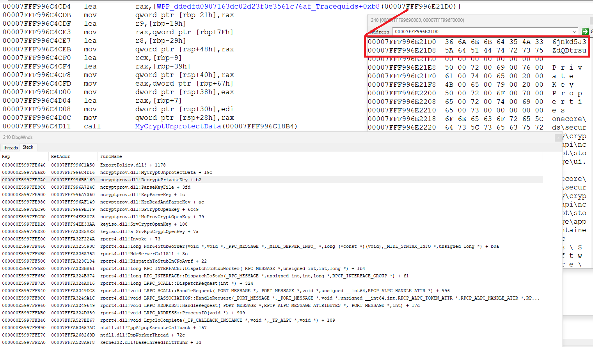

********************************************************************************

How to export certificate private key ( assume it not on smartcard but stored in file) even if it marked as not exportable ?

really this is possible and not too complex. are key is exportable or not saved in file/container, where private key is located too.
all what we need - hook data after decrypt and set exportable flag

here 2 case exist - cert can use legacy CSP or CNG storage providers. (look for CRYPT_KEY_PROV_INFO Structure )

in case CSP we need hook CryptUnprotectData api in current process ( usually this is mmc.exe if user use UI )

and look for magic value in pOptionalEntropy - "Hj1diQ6kpUx7VC4m"

look for [UnprotectExportabilityFlag](https://github.com/wisny101/Windows-Server-2003-Source/blob/master/ds/win32/ntcrypto/contman/contman.c#L1087)

and

[#define STUFF_TO_GO_INTO_MIX "Hj1diQ6kpUx7VC4m"](https://github.com/wisny101/Windows-Server-2003-Source/blob/master/ds/win32/ntcrypto/inc/contman.h#L58)

in case CNG is used we need inject dll to lsass. of course if it is PPL process, this is separate topic. but if not - no any problem do this

here we need hook CryptUnprotectDataNoUI from dpapi.dll and look for another magic

char DPAPI_ENTROPY_CNG_KEY_PROPERTIES[] = ["6jnkd5J3ZdQDtrsu";](https://o365blog.com/post/deviceidentity/)

by fact we change result of call to NCryptGetProperty with NCRYPT_EXPORT_POLICY_PROPERTY (L"Export Policy") 
and set NCRYPT_ALLOW_EXPORT_FLAG|NCRYPT_ALLOW_PLAINTEXT_EXPORT_FLAG (3)

and this is all.

so screenshots from debugger  

CNG

CSP

code of DLL which do hooks/unhooks in [src](src) project. look for [Entropy.cpp](src/Entropy.cpp)

********************************************************************************
